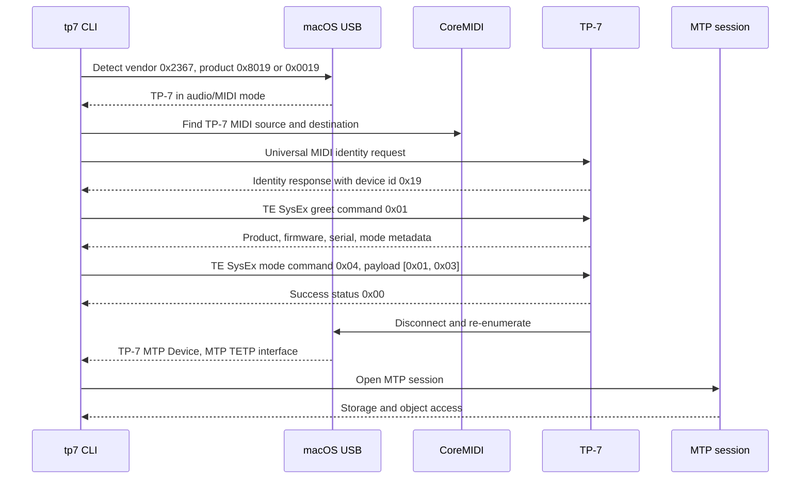
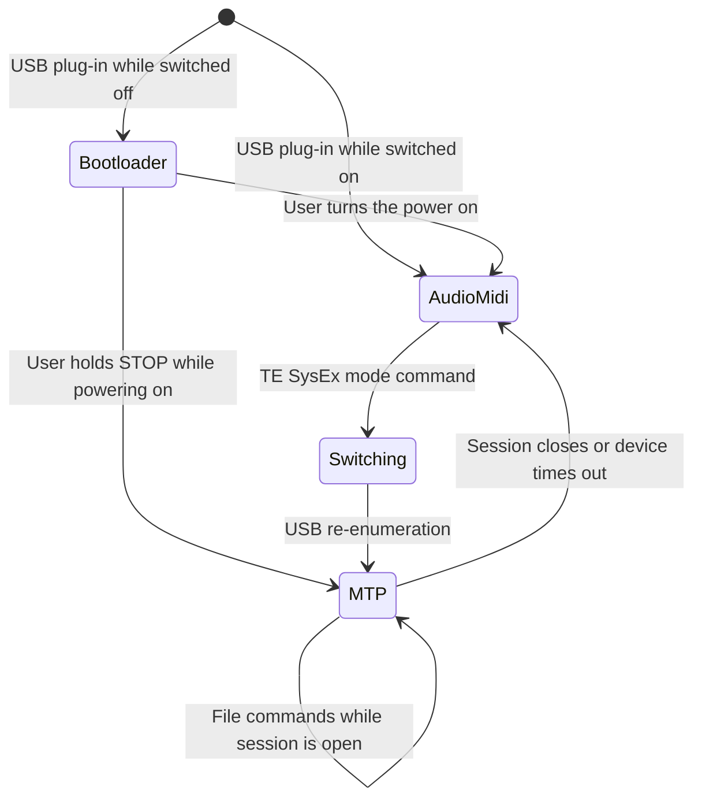
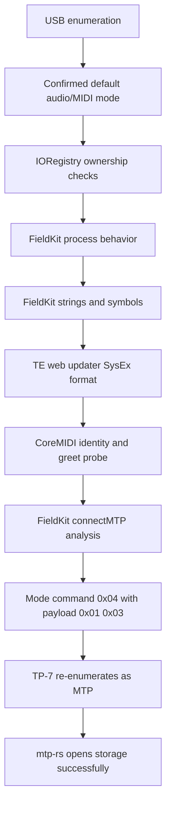

# TP-7 MTP Handshake

This document summarizes how the TP-7 switches from its normal USB audio/MIDI
mode into MTP mode, and how we reverse-engineered the sequence.

## Short Version

The TP-7 does not expose MTP as a normal macOS mountable device when first
plugged in. It starts as a USB audio/MIDI device. To access files, the CLI must:

1. Find the TP-7 over USB and CoreMIDI.
2. Send a Teenage Engineering SysEx `greet` command over MIDI.
3. Send a Teenage Engineering SysEx `mode` command over MIDI.
4. Wait for the TP-7 to re-enumerate as `TP-7 MTP Device`.
5. Open an MTP session and operate on files before the device returns to
   audio/MIDI mode.

FieldKit was a useful research reference, but the CLI must not depend on it at
runtime.

## Runtime Handshake



## Device States



## Powered-Off / Bootloader Personality

A TP-7 plugged in while its power switch is off still enumerates. It comes up
as vendor `0x2367`, product `0x0019`, with a single bulk-only mass-storage
interface and no MIDI. That is the te-boot bootloader/charger personality, not
a TP-7 in a file-transfer mode.

- The personality never changes on its own. There is no control request, SCSI
  command, or re-enumeration trick that wakes it, and FieldKit ignores devices
  in this state too.
- Because there is no MIDI interface, the SysEx mode switch has nothing to talk
  to. The CLI cannot switch a switched-off TP-7 into MTP.
- The user turns the power on. That re-enumerates the device in audio/MIDI
  mode, after which the normal SysEx switch works.
- TE's documented shortcut: holding STOP while turning the power on boots
  straight into MTP mode and skips the switch entirely.
- Firmware-update mode (hold MODE while powering on) also appears as mass
  storage, but with a disk. `tp7` cannot tell the two apart from USB
  descriptors alone.
- `tp7 doctor` reports this as a warning, and file commands fail with the
  "switched off" error. Under `--auto-connect` the CLI first prints the hint
  and waits up to 12 s for the device to reappear in audio/MIDI or MTP mode, so
  flipping the switch when prompted lets the command continue.

## SysEx Shape

The generic Teenage Engineering SysEx envelope is:

```text
f0 00 20 76 <device-id> 40 <flags> <request-id-low7> <command> <packed-payload> f7
```

Important bytes:

- Manufacturer id: `00 20 76`
- Device id observed from TP-7: `0x19`
- TE marker byte: `0x40`
- Request flag shape: `0x60`
- Response flag shape: `0x20`
- Payload bytes are packed into 7-bit-safe SysEx data.

Validated messages:

```text
Universal identity request:
f0 7e 7f 06 01 f7

Observed identity response:
f0 7e 19 06 02 00 20 76 19 00 01 00 00 00 00 00 f7

Greet request:
f0 00 20 76 19 40 60 01 01 f7

MTP mode switch request:
f0 00 20 76 19 40 60 05 04 00 01 03 f7

MTP mode switch success response:
f0 00 20 76 19 40 20 05 04 00 f7
```

The successful greet response included:

```text
mode:normal;product:TP-7;sw_version:1.1.9;os_version:1.1.9;serial:F1RTL11C;sku:TE025AS001;base_sku:TE025AS001
```

After the MTP switch, the TP-7 re-enumerated as:

```text
Product: TP-7 MTP Device
Interface: MTP TETP interface
Manufacturer: teenage engineering
Model: TP-7 MTP Device
Storage count: 1
```

## Reverse-Engineering Path



What each step taught us:

- USB enumeration showed no visible MTP interface in the default state.
- IORegistry showed audio, MIDI, and competing app ownership.
- FieldKit strings pointed to `MTPService`, `MIDIClient`, `greet`, `mode`,
  `sendMidiGreet`, `connectMTP`, `TeSysExCommand`, and `TeSysExMessage`.
- The official TE updater JavaScript explained the shared SysEx envelope,
  request IDs, responses, and 7-bit payload packing.
- CoreMIDI probes proved the TP-7 accepts TE SysEx directly.
- FieldKit analysis revealed the TP-7 MTP switch command and payload.
- `mtp-rs` proved the resulting device can be accessed without FieldKit.

## CLI Implications

- File commands switch to MTP when `--auto-connect` is set, open a session,
  perform the operation, and close cleanly in one flow.
- `tp7 status` cannot assume a previous `tp7 connect` left the TP-7 in MTP mode.
- The CLI should warn when FieldKit or other processes own TP-7 interfaces,
  but it should not require those apps.
- Newer firmware accepts mode payload `[0x01, 0x03]`. FieldKit suggests
  `[0x01, 0x02]` may be a fallback for older firmware.
- MTP support lives behind our own session layer. `ls`, `tree`, `stat`, and
  `pull`, `push`, `rename`, and `rm` now use that same switch/open/work/close
  flow.
- Right after the TP-7 enumerates (plug-in, power-on, or the flip back to
  audio mode after an MTP session) CoreMIDI may not list its endpoints yet,
  and the device may ignore the identity request for a few seconds. The CLI
  retries both for up to 12 s before reporting a MIDI failure.
- The USB product id depends on firmware. On `1.1.9` both personalities used
  `0x0019`. On `2.5.7` the audio/MIDI personality enumerates as `0x8019` and
  only MTP mode uses `0x0019`, so device detection matches either id while the
  MTP open path still looks for `0x0019`.
- A switched-off TP-7 enumerates as `0x0019` with a single mass-storage
  interface: the bootloader/charger personality. Only the power switch leaves
  it, so file commands report it instead of attempting a switch.
- TP-7 firmware `1.1.9` accepted file upload, rename, and delete in smoke tests,
  but rejected folder creation with MTP `GeneralError`.
- `push --overwrite` stages a replacement under a temporary remote name before
  it renames the old object out of the way, so the original file remains intact
  until the replacement upload succeeds.
- Recursive `push` only writes into remote folders that already exist. Missing
  remote folders remain unsupported until we find a reliable TP-7 folder-create
  path.
- Recursive `push` preflights the whole local tree before upload, so a missing
  remote folder or overwrite conflict fails before any file is written.
- `eject` is currently an MTP open/close validation command. It releases the
  session cleanly but does not send a reverse mode-switch command.
- The shared session layer retries initial TP-7 selection briefly because the
  device can disappear for a moment while returning from MTP to audio/MIDI mode.
- Auto-connect also retries transient CoreMIDI endpoint discovery for up to the
  same 12-second window used for MTP visibility because USB audio/MIDI mode can
  appear before the TP-7 MIDI endpoints are ready.
